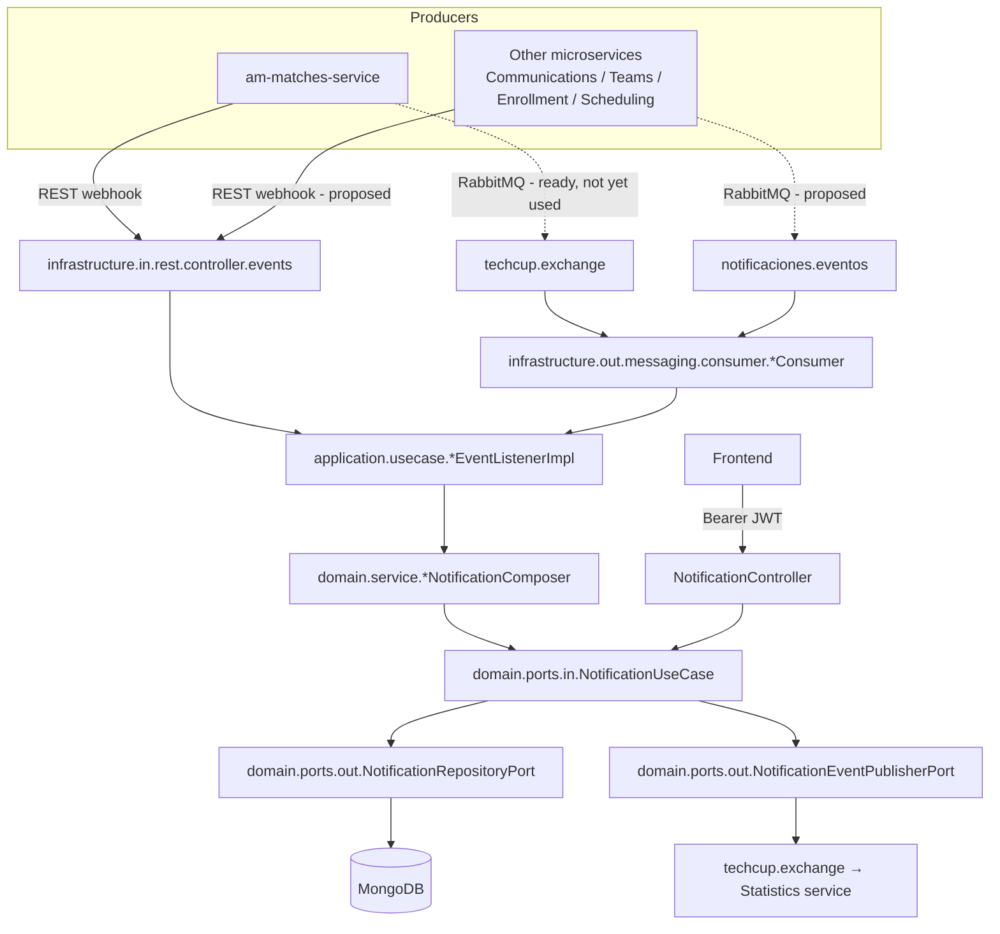
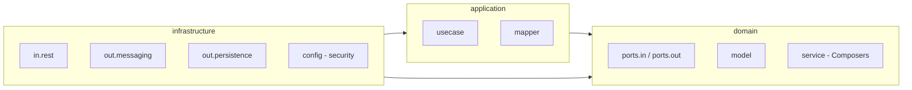

# Architecture

## System architecture

`service-notifications` is one of the ~12 independent microservices behind
**Astro Merge**. Inside that system it plays a single role: it is the
**sink** for anything another service decides is worth alerting a user
about, and the **source** of the history that the frontend's notification
bell reads from.

```
 am-matches-service ─┐
 Communications ──────┤                      ┌──────────────┐
 Teams ────────────── ┼─▶ service-notifications ─▶ MongoDB    │
 Enrollment ───────────┤   (REST webhooks +   │   (history)   │
 Scheduling/Tournaments┘    RabbitMQ queues)   └──────────────┘
                                  │
                                  ▼
                         techcup.exchange (RabbitMQ)
                                  │
                                  ▼
                          Statistics service
                                  ▲
                                  │
                          Frontend (REST, Gateway JWT)
```

Internally the service follows a **hexagonal (ports & adapters)**
architecture in three layers:

- **`domain`** — the model, the event contracts, and the inbound/outbound
  port interfaces. Imports nothing from the other two layers.
- **`application`** — the use cases that implement those ports. Only
  depends on `domain`.
- **`infrastructure`** — the REST controllers, RabbitMQ consumers, Mongo
  persistence, and security config that implement the ports and drive the
  use cases. Depends on `domain`/`application`, never the other way
  around.

See [Components](#components) for the full package breakdown and
[General flow](#general-flow) for how a request moves through these
layers.

## Architecture decisions

### Why RabbitMQ?

The service started as REST-only: every producing microservice called a
webhook, and a slow or unreachable producer had no way to retry a failed
delivery on its own. Adding RabbitMQ as a **second, equivalent** entry
point (see [Inter-service communication](#inter-service-communication-api-events))
gives every producer built-in retries, a dead-letter queue for messages
that keep failing, and the option to publish fire-and-forget instead of
waiting on a synchronous HTTP call. The REST webhooks were kept rather
than replaced, because `am-matches-service` — the one producer that is
actually connected today — already calls them in production, and
migrating a live integration to a new transport in the same change would
have added risk for no immediate benefit. Both transports invoke the same
domain ports, so a producer can switch from REST to RabbitMQ whenever it's
ready without this service changing at all.

### Why MongoDB and not a relational database?

A notification is a single, self-contained document: recipient, type,
message, an optional reference id, and a read/unread flag. There are no
joins to model and no cross-record transactions to coordinate — every
write and read is scoped to one notification or to "all notifications for
this recipient". That fits a document store more naturally than a
relational schema, and it avoids maintaining versioned migrations for a
shape that isn't expected to grow relational complexity: `auto-index-
creation: true` lets the one index this service needs (`recipientId`)
appear on startup instead of through a migration tool. MongoDB is also
compatible with Azure Cosmos DB for MongoDB vCore, which is the managed
option in the platform's Azure subscription.

### Inter-service communication: API / events

Other microservices reach this service through two channels that invoke
the exact same domain ports (`domain/ports/in`), so the business logic
never knows or cares which one was used:

- **REST webhooks** (`infrastructure/in/rest/controller/events/*`) — one
  `POST` endpoint per event type, authenticated with the internal API key.
  See [API](api.md#event-webhooks-service-to-service-internalapikey).
- **RabbitMQ queues** (`infrastructure/out/messaging/consumer/*`) — one
  `@RabbitListener` per event type, on one of two inbound exchanges:
  `notificaciones.eventos` (owned by this service, for producers without a
  confirmed shared-exchange prefix yet) and `techcup.exchange` (shared on
  CloudAMQP, for producers that already publish there). Each main queue
  has a matching `.dlq`: a listener retries a failing message up to 3
  times with exponential backoff, and if it still fails the message is
  routed to its dead-letter queue instead of being lost or retried
  forever. Every inbound payload carries a `schemaVersion` so the contract
  can evolve without breaking existing producers.

Outbound, the service publishes a minimal `NotificationCreatedMessage`
(id, recipient, type, timestamp — never the message text) to
`techcup.exchange` every time a notification is created, for the
Statistics service to consume.

Which producer is actually connected through which channel — and which
integrations are still only proposed — is tracked on its own page:
[Service Integration](integracion-servicios.md).

## Design patterns

| Pattern | Where | Why |
|---|---|---|
| **Hexagonal / Ports & Adapters** | `domain/ports/{in,out}` implemented by `application` (inbound) and `infrastructure` (outbound) | Keeps business rules ignorant of HTTP, Mongo, and RabbitMQ, so any of the three can change independently |
| **Adapter** | `infrastructure/in/rest/controller/events/*` and `infrastructure/out/messaging/consumer/*` | REST and RabbitMQ are two interchangeable adapters over the same inbound port for a given event |
| **Composer** (translator/builder) | `domain/service/*NotificationComposer` (one per event type) | Turns an event-specific record into a `CreateNotificationCommand`, keeping the "how do I phrase this notification" decision out of the use case |
| **Repository + Adapter** | `domain/ports/out/NotificationRepositoryPort` → `infrastructure/out/persistence/adapter/NotificationRepositoryAdapter` | Decouples the domain from Spring Data Mongo's document API |
| **DTO / Mapper** | `application/mapper/NotificationMapper`, `infrastructure/out/persistence/mapper/NotificationPersistenceMapper` | Explicit conversion at every boundary (domain ↔ HTTP response, domain ↔ Mongo document) instead of leaking one model into another layer |
| **Chain of Responsibility** | `infrastructure/config/SecurityConfig` filter chain (`JwtClaimsFilter`, `InternalApiKeyFilter`) | Two independent authentication mechanisms are evaluated in sequence, each producing a different principal type |
| **Retry with backoff** | `RabbitMqConfig` (`RetryOperationsInterceptor`) | Absorbs transient failures on the RabbitMQ entry point before giving up to the DLQ |

## Components

```
domain/
├── model/            Notification, NotificationType, model/event/* (event records, no framework annotations)
├── service/          *NotificationComposer (6) — event record → CreateNotificationCommand
├── ports/
│   ├── in/           NotificationUseCase, CreateNotificationCommand, *EventListener (6 interfaces)
│   └── out/          NotificationRepositoryPort, NotificationEventPublisherPort
└── exception/        NotificationNotFoundException, NotificationAccessDeniedException

application/
├── usecase/          NotificationServiceImpl, *EventListenerImpl (6) — orchestrates composer + repository, no HTTP/Mongo/RabbitMQ awareness
└── mapper/           NotificationMapper (domain → response DTO)

infrastructure/
├── in/rest/
│   ├── controller/          Webhooks + user-facing API (delegate to the inbound ports, no business logic)
│   ├── swagger/              Interfaces holding the OpenAPI annotations (@Operation/@ApiResponse/examples), separate from the controller
│   └── dto/{request,response}/  HTTP boundary DTOs, with Bean Validation
├── out/
│   ├── persistence/
│   │   ├── mongo/            NotificationDocument (@Document), NotificationMongoRepository (Spring Data)
│   │   ├── mapper/            NotificationPersistenceMapper (domain ↔ document)
│   │   └── adapter/           NotificationRepositoryAdapter (implements the outbound port)
│   └── messaging/
│       ├── config/            RabbitMqConfig (exchanges, queues, DLQ, retries)
│       ├── dto/                *MessageV1 (versioned inbound payloads) + NotificationCreatedMessage (outbound, towards Statistics)
│       ├── consumer/           9 *Consumer (@RabbitListener)
│       └── producer/           NotificationEventPublisher (implements the outbound port towards Statistics)
└── config/            SecurityConfig, OpenApiConfig, InternalApiKeyProperties, MessagingProperties
    └── security/       JwtClaimsFilter, InternalApiKeyFilter, CurrentUserProvider, AuthenticatedUser, InternalServicePrincipal
```

The `notification` collection stores `id`, `recipientId`, `type` (the
`NotificationType` enum — kept explicit and specific, e.g. separate
approved/rejected/cancelled constants, rather than a generic type plus a
status field, so a screen reader isn't left announcing just a color or
icon), `message`, `referenceId` (so the frontend can navigate to the
related resource), `read`, `createdAt`, and `readAt`.

## General flow

**Inbound event → notification:**

1. An event arrives either as a REST webhook request (authenticated via
   `X-Internal-Api-Key`) or as a RabbitMQ message on one of the inbound
   queues.
2. The controller or `@RabbitListener` deserializes the payload and calls
   its `toDomain()` conversion into the matching event record
   (`domain/model/event/*`) — this is the only place REST and RabbitMQ
   payloads differ.
3. The corresponding `*EventListenerImpl` (application layer) receives the
   event record, hands it to its `*NotificationComposer` to build a
   `CreateNotificationCommand`, and passes that command to
   `NotificationUseCase.create`.
4. `NotificationServiceImpl` persists the notification through
   `NotificationRepositoryPort` and publishes a `NotificationCreatedMessage`
   through `NotificationEventPublisherPort`.
5. If the message came from RabbitMQ and step 2-4 throws, the container
   retries up to 3 times before routing the message to its `.dlq`; a REST
   webhook always returns `202 Accepted` before this pipeline finishes
   running.

**User queries their history:**

1. The frontend calls a `/api/notificaciones/**` endpoint with the
   Gateway's JWT.
2. `JwtClaimsFilter` decodes the `sub` claim and builds an
   `AuthenticatedUser` principal — the JWT signature itself is not
   re-verified, since the Gateway already did that.
3. `CurrentUserProvider` requires that principal type specifically; an
   `InternalServicePrincipal` (authenticated with the API key instead)
   is rejected here.
4. `NotificationController` delegates to `NotificationUseCase`, which
   reads or updates through `NotificationRepositoryPort`, and
   `NotificationMapper` converts the result to `NotificationResponse`.

## UML and architecture diagrams

The diagrams below cover the two flows described in
[General flow](#general-flow): how an inbound event becomes a persisted
notification, and how the layers depend on each other. Source diagram
files (if exported from a modeling tool) live under
`docs/assets/diagrams/`.

## Diagrams




