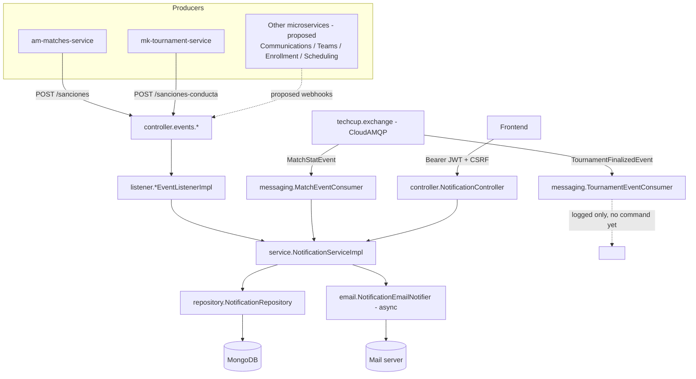
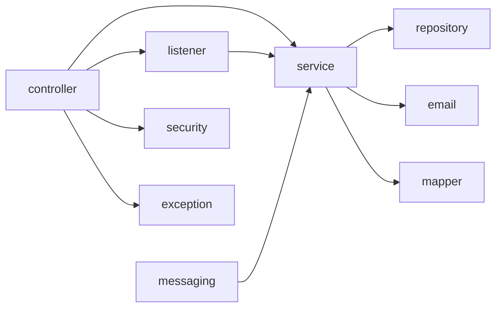

# Architecture

## System architecture

`service-notifications` is one of the ~12 independent microservices behind
**Astro Merge**. Inside that system it plays a single role: it is the
**sink** for anything another service decides is worth alerting a user
about, and the **source** of the history that the frontend's notification
bell reads from.

```
 am-matches-service ────┐
 mk-tournament-service ─┤
 Communications ────────┼─▶ REST webhooks ─┐
 Teams ──────────────── ┤                  │
 Enrollment ─────────── ┤                  ▼
 Scheduling ────────────┘          service-notifications ──▶ MongoDB (history)
                                            │      │
 techcup.exchange (CloudAMQP) ─────────────▶│      ▼
   match/tournament events                  │   email (best-effort, async)
                                             │
 Frontend (REST, Gateway JWT) ──────────────▶│
```

Internally the service follows a straightforward layered design:

```
controller  →  listener  →  service  →  repository
```

- **`controller`** — REST webhooks (one per event type) and the
  user-facing notification API. Only deserializes, validates, and
  delegates.
- **`listener`** — translates each event-specific DTO into a
  `CreateNotificationCommand`. Doesn't know about persistence or HTTP.
- **`service`** — `NotificationServiceImpl` persists notifications and
  resolves history queries; it has no idea whether a notification came
  from a webhook or from RabbitMQ.
- **`messaging`** — RabbitMQ consumers for the two event types that arrive
  from the shared broker instead of a webhook (see
  [Inter-service communication](#inter-service-communication-api-events)).
- **`security`** — the JWT and API-key filters, plus CSRF handling, all in
  one Spring Security filter chain.

See [Components](#components) for the full package breakdown and
[General flow](#general-flow) for how a request moves through these
layers.

## Architecture decisions

### Why RabbitMQ?

Competition and Tournaments already publish match/tournament events to
`techcup.exchange` on the platform's shared CloudAMQP broker, mainly for
the Statistics service. Rather than asking those teams to *also* build and
call a dedicated webhook for Notifications, this service subscribes
directly to that same exchange for the two event types it cares about.
`RabbitAdmin` is configured with `ignoreDeclarationExceptions(true)`
specifically so that a broker outage or a missing credential never takes
down the whole application — this service's primary intake is still the
REST webhooks, which don't depend on RabbitMQ at all, so a Rabbit failure
should degrade one feature, not the service. One of the two consumers
(`TournamentEventConsumer`) currently only logs what it receives: the
`TournamentFinalizedEvent` payload doesn't carry a recipient or a message,
so there isn't yet a product decision on what notification, if any, it
should produce.

### Why MongoDB and not a relational database?

A notification is a single, self-contained document: recipient, type,
message, an optional reference id, and a read/unread flag. There are no
joins to model and no cross-record transactions to coordinate — every
write and read is scoped to one notification or to "all notifications for
this recipient". That fits a document store more naturally than a
relational schema, and it avoids maintaining versioned migrations for a
shape that isn't expected to grow relational complexity: `auto-index-
creation: true` lets the indexes this service needs appear on startup
instead of through a migration tool. MongoDB is also compatible with Azure
Cosmos DB for MongoDB vCore, the managed option in the platform's Azure
subscription.

### Inter-service communication: API / events

Other microservices reach this service two different ways:

- **REST webhooks** (`controller/events/*`) — one `POST` endpoint per
  event type, authenticated with the internal API key, always responding
  `202 Accepted` before the notification (and its email) are necessarily
  done processing. This is the primary, and for most event types the
  only, way producers reach this service. See
  [API](api.md#event-webhooks-service-to-service-internalapikey).
- **RabbitMQ consumption** (`messaging/*`) — a read-only subscription to
  `techcup.exchange`, for the two event types described in
  [Why RabbitMQ?](#why-rabbitmq). This is not a second entry point for the
  9 webhook events; it's a separate mechanism for events that were never
  going to get a dedicated webhook because the producer already publishes
  them to the shared bus for Statistics.

There is no outbound channel in the other direction: this service doesn't
publish anything back to RabbitMQ or call any other microservice's API —
its only outbound side effect is the best-effort email described in
[Components](#components).

Which producer is actually connected through which channel — and which
integrations are still only proposed — is tracked on its own page:
[Service Integration](integracion-servicios.md).

## Design patterns

| Pattern | Where | Why |
|---|---|---|
| **Translator** | `listener/*Impl` (one per event type) | Turns an event-specific DTO into a single `CreateNotificationCommand` shape, so `NotificationServiceImpl` never has to know which event produced it |
| **Repository** | `repository/NotificationRepository` (Spring Data `MongoRepository`) | Standard data-access abstraction over MongoDB, including a custom `markAllAsRead` query |
| **DTO** | `dto/event/*`, `dto/response/*` | Keeps the wire format (webhook payloads, API responses) separate from the persisted `entity.Notification` |
| **Chain of Responsibility** | `SecurityConfig`'s filter chain (`JwtClaimsFilter`, `InternalApiKeyFilter`, CSRF handling) | Each filter independently decides whether it recognizes the request and contributes an authentication, before the chain reaches the controller |
| **Centralized exception handling** | `exception/GlobalExceptionHandler` (`@RestControllerAdvice`) | One place maps every business and framework exception to a consistent `ErrorResponse` |
| **Best-effort / fail-safe integration** | `RabbitMQConfig` (`ignoreDeclarationExceptions`), `NotificationEmailNotifier` (catches and logs instead of propagating) | Two outbound-ish dependencies (the shared broker, the mail server) are allowed to fail without affecting the in-app notification, which is already persisted by the time either runs |
| **Asynchronous side effect** | `NotificationEmailNotifier.notifyByEmail` (`@Async`, see `AsyncConfig`) | The email send runs on a separate thread so a slow SMTP server never delays the caller |

## Components

```
config/          SecurityConfig, RabbitMQConfig, EmailProperties, InternalApiKeyProperties, AsyncConfig, OpenApiConfig

controller/
├── NotificationController      User-facing history API (list, unread count, mark read)
└── events/*                    One REST webhook controller per event type (6 classes, 9 endpoints)

listener/        *EventListener + *EventListenerImpl (7 pairs) — event DTO → CreateNotificationCommand

service/         NotificationService, NotificationServiceImpl, CreateNotificationCommand — persistence + history queries

repository/      NotificationRepository (Spring Data MongoDB)

entity/          Notification (@Document), entity/enums/NotificationType

dto/
├── event/       One record per event type (webhook payloads and RabbitMQ payloads share these where applicable)
└── response/    NotificationResponse, UnreadCountResponse, ErrorResponse

mapper/          NotificationMapper (entity → NotificationResponse)

messaging/       MatchEventConsumer, TournamentEventConsumer (@RabbitListener) + their event records

email/           EmailSenderPort → JavaMailEmailSender, NotificationEmailNotifier, RecipientEmailResolver → ConfiguredRecipientEmailResolver, NotificationEmailTemplates

security/        JwtClaimsFilter, InternalApiKeyFilter, AuthenticatedUser, InternalServicePrincipal, CurrentUserProvider

exception/       GlobalExceptionHandler, NotificationNotFoundException, NotificationAccessDeniedException
```

The `notification` collection stores `id`, `recipientId`, `type` (the
`NotificationType` enum — kept explicit and specific, e.g. separate
approved/rejected/cancelled constants, rather than a generic type plus a
status field, so a screen reader isn't left announcing just a color or
icon), `message`, `referenceId` (so the frontend can navigate to the
related resource), `read`, `createdAt`, and `readAt`, with compound
indexes on `(recipientId, read)` and `(recipientId, createdAt)` for the
history and unread-count queries.

## General flow

**REST webhook → notification:**

1. A producer calls one of the 9 `POST /api/notificaciones/**` webhooks
   with `X-Internal-Api-Key`. `SecurityConfig` grants
   `ROLE_SERVICIO_INTERNO` for that header and exempts these
   service-to-service paths from CSRF.
2. The controller validates the payload (Bean Validation) and calls the
   matching `*EventListener`.
3. The `*EventListenerImpl` builds the notification message/type for that
   event and calls `NotificationService.create` with a
   `CreateNotificationCommand`.
4. `NotificationServiceImpl` saves the `Notification` and calls
   `NotificationEmailNotifier.notifyByEmail` — which runs `@Async`, so the
   controller can return `202 Accepted` without waiting on it.
5. The email notifier resolves the recipient's address (currently a
   configured placeholder, see [Components](#components)), builds the
   subject/body from `NotificationEmailTemplates`, and sends it; any
   failure is logged, never propagated back to the webhook caller.

**RabbitMQ event → notification (match results only):**

1. `MatchEventConsumer` receives a `MatchStatEvent` from
   `techcup.notifications.match-events` and calls
   `NotificationService.create` directly — there's no `listener`
   interface in this path, since there's no REST equivalent to keep in
   sync with.
2. `TournamentEventConsumer` receives a `TournamentFinalizedEvent` and
   only logs it, for the reason explained in
   [Why RabbitMQ?](#why-rabbitmq).

**User queries or updates their history:**

1. The frontend calls a `/api/notificaciones/**` endpoint with the
   Gateway's JWT (`Authorization: Bearer`), and for `PATCH` requests also
   the CSRF token from the `XSRF-TOKEN` cookie, echoed in the
   `X-XSRF-TOKEN` header.
2. `JwtClaimsFilter` decodes the `sub` claim and builds an
   `AuthenticatedUser` principal — the JWT signature itself is not
   re-verified, since the Gateway already did that.
3. `CurrentUserProvider` requires that principal type specifically; an
   `InternalServicePrincipal` (authenticated with the API key instead) is
   rejected here.
4. `NotificationController` delegates to `NotificationService`, and
   `NotificationMapper` converts the result to `NotificationResponse`.

## UML and architecture diagrams

The diagrams below cover the two flows described in
[General flow](#general-flow): how an inbound event becomes a persisted
notification (and, separately, an email), and how the packages depend on
each other. Source diagram files (if exported from a modeling tool) live
under `docs/assets/diagrams/`.

## Diagrams




