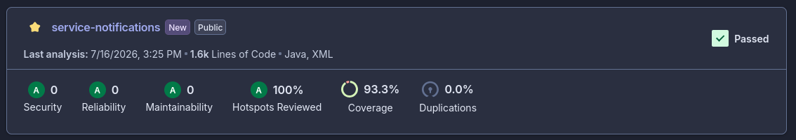

# Testing

Context and integration tests use Testcontainers, so you only need Docker
available on the machine running the tests (no need to start
Mongo/RabbitMQ by hand). If you still want the infrastructure up for
manual testing:

## What the tests cover

| Area | Covers |
|---|---|
| `application/usecase/*ListenerImplTest` | Building a notification from each domain event type (sanction, message, invitation, etc.) — one test per listener, plus use-case exception propagation |
| `application/usecase/NotificationServiceImplTest` | `NotificationUseCase` rules: recipient ownership, mark-as-read idempotency, unread count, `CreateNotificationCommand` validation, publishing the event towards Statistics |
| `application/mapper/NotificationMapperTest` | Domain → `NotificationResponse` mapping |
| `infrastructure/in/rest/controller/**` | HTTP contract of the user endpoints and the event webhooks, including payload validation (invalid body) for each endpoint |
| `infrastructure/config/security/*` | `JwtClaimsFilter`, `InternalApiKeyFilter`, `CurrentUserProvider` (including that an internal-service principal cannot read the user's history, and vice versa) |
| `infrastructure/in/rest/exception/GlobalExceptionHandlerTest` | The 7 handlers and the shape of `ErrorResponse` (consistent Spanish message) |
| `infrastructure/out/persistence/mongo/NotificationMongoRepositoryTest` | The custom `markAllAsRead` query (`@Query`+`@Update`) against a real Mongo (Testcontainers) |
| `infrastructure/out/persistence/adapter/NotificationRepositoryAdapterTest` | Domain ↔ document mapping in the persistence adapter |
| `infrastructure/out/messaging/producer/NotificationEventPublisherTest` | Minimal payload published to the Statistics exchange |
| `infrastructure/out/messaging/consumer/RabbitMqConsumerIntegrationTest` | A valid message reaches the same domain port as the equivalent REST webhook; a corrupted message ends up in the DLQ after retries (Testcontainers RabbitMQ) — represents the pattern shared by all 9 consumers |
| `ServiceNotificationsApplicationTests` | Spring Boot context load (real MongoDB and RabbitMQ via Testcontainers) |

## Minimum coverage

The CI pipeline applies an **80%** line-coverage gate with JaCoCo
(`jacoco-maven-plugin`, goal `check`, bound to the `verify` phase),
excluding DTOs, MongoDB entities, configuration classes, and the main
bootstrap class.

## Manual end-to-end verification

Beyond the automated tests, the full flow was validated manually against
the Docker stack (see the step-by-step guide in the `README.md`): the 9
event webhooks, the 4 user endpoints, the three security cases (no API
key, no JWT, crossed mechanism), and publishing a test message directly to
`notificaciones.sanciones.q` via the RabbitMQ admin panel, confirming that
both inbound paths (REST and RabbitMQ) produce the same result.

See [Configuration](configuracion.md) for environment variables and
[Architecture](arquitectura.md) for the business rules these tests verify.
